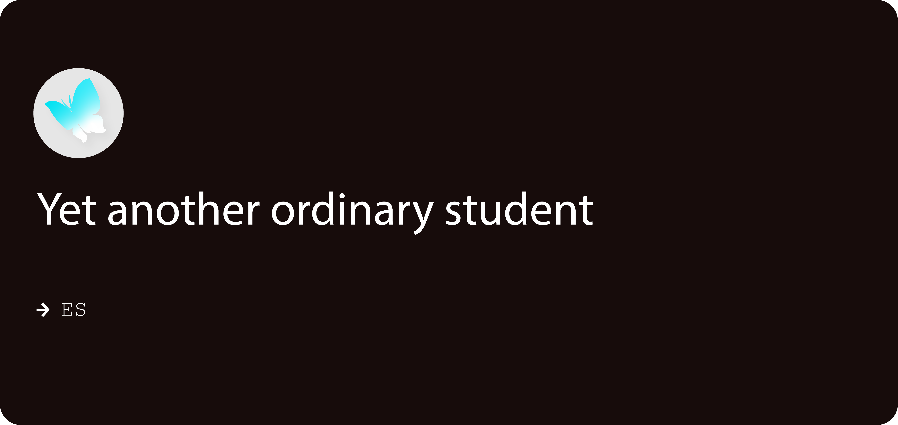

### Hi!👋 I'm ES📖

## **☕ About me**

I'm ES, a passionate 15yo who currently focused on Android Modding and Development. Other than that, I also interested in Web Development and Open Source stuff. I love to learn new things and always open to new opportunities. my hobbies are playing games (random), reading novels, watching anime, and sometimes tinkering with random stuff like coding (I love doing this).

## **📊 Github Stats**

    
    

## **🧋 Cutie Counter**

	
	  
	<code>People who visit my profile :3 Hehe~ another cutie has been caught.</code>

## **📫 Contacts**

**Please Contact me on Telegram for a quick response:** [ES](https://t.me/alter_ego_ES)
